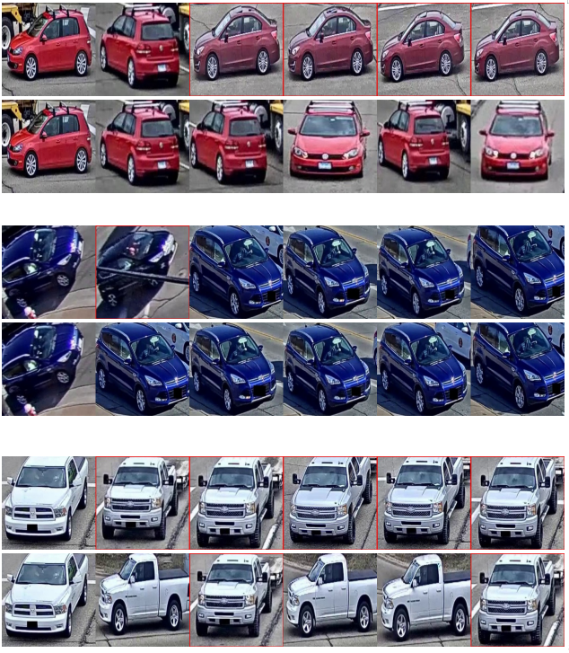

# VOC-ReID: Vehicle Re-identification based on Vehicle-Orientation-Camera

This repo includes the 2nd place solution for [AICity2020](https://www.aicitychallenge.org/) Challenge ReID track. 
[Our paper](http://arxiv.org/abs/2004.09164)

For commercial co-operation, please visit our website [RuiyanAI(睿沿科技)](http://www.ruiyanai.com/)

## Introduction
Our work aims to eliminate the bias posed by similar background and shape

This project is mainly based on [reid-strong-baseline](https://github.com/michuanhaohao/reid-strong-baseline) 
and [deep-person-reid](https://github.com/KaiyangZhou/deep-person-reid)


## TODO
- [x] FP16 training (30% faster with no precision drop)
- [x] circle loss (borrowed from [fast-reid](https://github.com/JDAI-CV/fast-reid))
- [x] more metric learning methods (GeM, arcface, batch_soft)
- [x] more backbones (OSNet, ResNest, RegNet)

## requirement
1. pytorch>=1.2.0
2. yacs
3. [apex](https://github.com/NVIDIA/apex) (optional for FP16 training, if you don't have apex installed, please turn-off FP16 training by setting SOLVER.FP16=False)
````
$ git clone https://github.com/NVIDIA/apex
$ cd apex
$ pip install -v --no-cache-dir --global-option="--cpp_ext" --global-option="--cuda_ext" ./
````
4. python>=3.7
5. cv2


## Reproduce the result on AICity 2020 Challenge
Please see [AICity2020.md](AICity2020.md) for details.


## Train
We use [ResNet-ibn](https://github.com/XingangPan/IBN-Net) as backbone which proves to be quite robust on Person ReID. 
Download ImageNet pretrain model at [here](https://drive.google.com/drive/folders/1thS2B8UOSBi_cJX6zRy6YYRwz_nVFI_S) 
- **Vehicle ReID.**
```
bash ./scripts/aicity20/train.sh
```
- **Orientation ReID** Train orientation ReID model
```
bash ./scripts/aicity20/ReOriID.sh
```
- **Camera ReID** Train camera ReID model
```
bash ./scripts/aicity20/ReCamID.sh
```
you can either download our trained [models](https://drive.google.com/open?id=1W8nw3GEYyxZiuDSk_wdXTErHFxtfKfKI)


## Test
- generate orientation and camera similarity matrix
```
# ReCamID
python tools/test.py --config_file='configs/aicity20.yml' \
MODEL.DEVICE_ID "('1')" \
MODEL.NAME "('resnet50_ibn_a')" \
MODEL.MODEL_TYPE "baseline" \
DATASETS.TRAIN "('aicity20',)" \
DATASETS.TEST "('aicity20',)" \
DATASETS.ROOT_DIR "('/home/zxy/data/ReID/vehicle')" \
MODEL.PRETRAIN_CHOICE "('self')" \
TEST.WRITE_RESULT True \
TEST.WEIGHT "('./output/aicity20/0409-ensemble/ReCamID/best.pth')"

python ./tools/aicity20/compute_distmat_from_feats.py --src_dir ./output/aicity20/0409-ensemble/ReCamID/

# ReOriID
python tools/test.py --config_file='configs/aicity20.yml' \
MODEL.DEVICE_ID "('2')" \
MODEL.NAME "('resnet50_ibn_a')" \
MODEL.MODEL_TYPE "baseline" \
DATASETS.TRAIN "('aicity20',)" \
DATASETS.TEST "('aicity20',)" \
DATASETS.ROOT_DIR "('/home/zxy/data/ReID/vehicle')" \
MODEL.PRETRAIN_CHOICE "('self')" \
TEST.WRITE_RESULT True \
TEST.WEIGHT "('./output/aicity20/0409-ensemble/ReOriID/best.pth')"

python ./tools/aicity20/compute_distmat_from_feats.py --src_dir ./output/aicity20/0409-ensemble/ReOriID/
```
- Vehicle ReID based on orientation and camera 
```
python tools/aicity20/submit.py --config_file='configs/aicity20.yml' \
MODEL.DEVICE_ID "('1')" \
MODEL.NAME "('resnet50_ibn_a')" \
MODEL.MODEL_TYPE "baseline" \
DATASETS.TRAIN "('aicity20',)" \
DATASETS.TEST "('aicity20',)" \
DATASETS.ROOT_DIR "('/home/zxy/data/ReID/vehicle')" \
MODEL.PRETRAIN_CHOICE "('self')" \
INPUT.SIZE_TRAIN '([320, 320])' \
INPUT.SIZE_TEST '([320, 320])' \
TEST.DO_RERANK True \
TEST.RERANK_PARAM "([50, 15, 0.5])" \
TEST.FLIP_TEST True \
TEST.WRITE_RESULT True \
TEST.USE_VOC True \
TEST.CAM_DIST_PATH './output/aicity20/0409-ensemble/ReCamID/feat_distmat.npy' \
TEST.ORI_DIST_PATH './output/aicity20/0409-ensemble/ReOriID/feat_distmat.npy' \
TEST.WEIGHT "('./output/aicity20/0409-ensemble/r50-320-circle/best.pth')"
```

## Performance
Ablation study on AICity 2020 validation dataset

|method|mAP|Rank1|comment|
|------|---|-----|-------|
|BagOfTricks|21.6%|42.1%|[reid-strong-baseline](https://github.com/michuanhaohao/reid-strong-baseline)|
|+Arcface|26.2%|46.7%|Arcface loss|
|+Circle|29.7%|50.8%|circle loss|
|+Syn|39.5%|64.0%|Syn denotes Synthetic dataset VehicleX|
|+WeaklyAug|44.4%|65.3%|WeaklyAug denotes weakly supervised crop augmentation|
|+Orientation|47.0%|70.5%|penalized by Orientation ReID|
|+Camera|50.8%|75.5%|penalized by Camera ReID|

 AICITY2020 Challange Track2 Leaderboard
 
 |TeamName|mAP|Link|
 |--------|----|-------|
 |Baidu-UTS|84.1%|[code](https://github.com/layumi/AICIty-reID-2020)|
 |**RuiYanAI(ours)**|78.1%|
 |DMT|73.1%|[code](https://github.com/heshuting555/AICITY2020_DMT_VehicleReID)|
 
 
 
 Results on VeRi
 
 |method|mAP|Rank1|comment|
 |------|----|----|-----|
 |ResNet50_ibn_a|81.6%|96.8%|P=4,K=16,Size=[320, 320], [log](https://drive.google.com/open?id=1MAErCPplveRmwaVnxBCvXM2wkiUSrpKd)|
 |+Orientation|82.8%|97.6%|distmat - 0.1 * ori_distmat, [log](https://drive.google.com/open?id=19gccYRO_pY6ZQMGVpEu67Y2lOk7Ufkm_)|
 |+Camera|-|-| |
 
Failure cases that rectified by Orientation and Camera information



## Citation
If you find our work helpful, please cite [it](http://arxiv.org/abs/2004.09164)
```
@inproceedings{
 title={VOC-ReID: Vehicle Re-identification based on Vehicle-Orientation-Camera},
 author={Zhu, Xiangyu and Luo, Zhenbo and Fu, Pei and Ji, Xiang},
 booktitle={Proc. CVPR Workshops},
 year={2020}
}
```